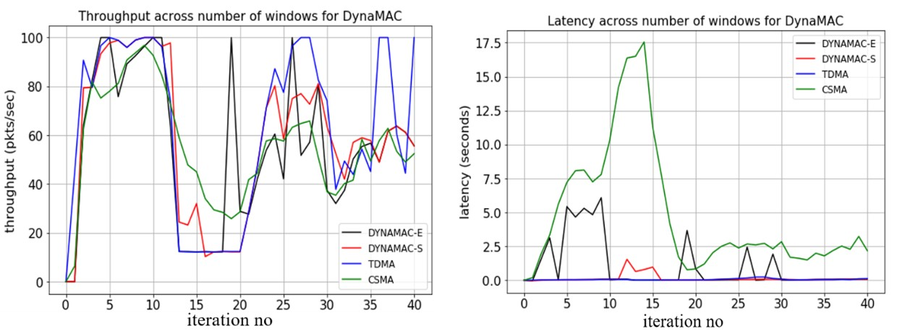

# DynaMAC
---

**ECE257B Project - Reinforcement Learning based MAC selection engine** - *Ankit Agarwal, Rohit Kumar and Yeswanth Guntupalli*

## Description
This repo contains the simulation code used for simulating and evaluating DynaMAC - an RL based MAC Selection Engine. 

## Requirements
Python with numpy installed

## Code
The main functions involved in simulating DynaMAC are:

- `generate_events`
- `csma_simulator`
- `tdma_simulator`
- `qlearning_egreedy`
- `qlearning_boltzmann`
- `decision_final`
- `Dynamac_SOMAC_test`

## Steps to run the code (`demo.ipynb`)

- A sample version of the above test and results are also included in a python notebook `demo.ipynb` and inluded in the repository

This notebook allows you to run and test the following:
- Run Standalone CSMA simulator for inreasing number of nodes and different network conditions over configurable monte-carlo simulations
- Run Standalone TDMA simulator for inreasing number of nodes and different network conditions over configurable monte-carlo simulations
- Run DynaMAC comparison for a given network condition and get a comparison of performance across TDMA only, CSMA only , DynaMAC with eplison greedy approach and DynaMAC with softmax approach

## DynaMAC Comparison Test

- This simulation gives the user control over the number of nodes, number of packets per node per second, duration of high traffic, duration of low traffic etc 
- Based on the above parameters, the code calculates the throughput and latency for the network for the 4 different approaches mentioned above 
